# Pim Etiket — Sipariş & Prova Akışı V2 (Sefa 22 May 2026)

> **Hedef:** Müşteri yolculuğunu Sefa'nın 7-adımlı mantığına göre revize et.
> **Karşılaştırma:** StickerMule, Sticker You, Vistaprint, Moo gibi öncü
> "online proof" e-ticaret sitelerinin akışı.

---

## 1. Sefa'nın 7-adımlı sistem mantığı

| # | Adım | Sistem davranışı |
|---|---|---|
| 1 | Müşteri sipariş oluştur | Konfigüratör: malzeme/ölçü/adet/şekil |
| 2 | Görsel yükle | DesignDropZone → Supabase Storage temp upload |
| 3 | Sepete at | cart_items.designTempId + designCount |
| 4 | Ödeme | PayTR iframe + 3DS |
| 5 | Ödeme sonuç ekranı | **Akıllı CTA**: designCount == uploaded → "Provayı İncele"; eksik → "Tasarım Yükle" + "Sipariş Detay" |
| 6 | Prova inceleme | POC iframe: mantıksal bıçak (OpenCV) → hata varsa AI fallback (OpenAI Vision) → kullanıcı kontrol → çözemezse uzmana |
| 7 | Uzman akışı | Operatör tasarımı indir → düzelt → tekrar yükle → kullanıcı onay → baskı |

---

## 2. Devre şeması (Mermaid)

```mermaid
flowchart TD
    Start([Musteri ziyaret]) --> Config[Konfiguratorde<br/>malzeme + olcu + adet]
    Config --> Designer[Tasarim yukle<br/>PNG/PDF/AI/PSD]

    Designer -->|Yukledi| AddCart[Sepete ekle<br/>designCount: N]
    Designer -->|Yuklemedi| ConfirmSkip{Bilincli sonra<br/>yuklerim?}
    ConfirmSkip -->|TAMAM| AddCart
    ConfirmSkip -->|IPTAL| Designer

    AddCart --> Checkout["/odeme"]
    Checkout --> PayTR[PayTR iframe + 3DS]
    PayTR --> Callback[payment-callback IPN<br/>order INSERT]

    Callback --> StatusCheck{Tasarim<br/>cart'a kaydedildi mi?}
    StatusCheck -->|Evet| ProofGen[order.status:<br/>proof_generating<br/>POC headless<br/>otomatik bicak]
    StatusCheck -->|Hayir| AwaitUpload[order.status:<br/>awaiting_upload]

    AwaitUpload --> Sonuc1["/odeme-sonuc<br/>4-step CTA:<br/>1. Tasarim Yukle (aktif)<br/>2-3-4 bekliyor"]
    Sonuc1 --> CTA1[Buton: Tasarimini yukle]
    CTA1 --> UploadPage["/siparis/id/tasarim-yukle"]
    UploadPage --> Multi{designsRequired<br/>vs<br/>designsUploaded}
    Multi -->|Tum slot dolu| Trigger[Mig 061 trigger:<br/>awaiting_upload<br/>-> proof_pending]
    Multi -->|Eksik| Multi
    Trigger --> ProofGen

    ProofGen --> Sonuc2["/odeme-sonuc<br/>4-step CTA:<br/>1. Tasarim YUKLENDI tik<br/>2. Sistem hazirligi aktif<br/>3-4 bekliyor"]
    Sonuc2 --> CTA2[Buton: Bicak cizimini izle]
    CTA2 --> Detay["/siparis/id<br/>Prova karti + POC iframe inline"]

    Detay --> POCAuto{POC otomatik<br/>bicak basarili?}
    POCAuto -->|Evet OpenCV| Render[Renk + Bicak + Beyaz plan<br/>katman togglelari ile goster]
    POCAuto -->|Hayir vector| AIFallback[OpenAI Vision API<br/>cutline tahmin et]
    AIFallback --> Render
    AIFallback -->|API hata| Manual[Manuel cutline upload<br/>buton goster]

    Render --> UserDecision{Kullanici memnun?}
    UserDecision -->|Onayla| Onayla[order.status:<br/>proof_approved]
    UserDecision -->|Duzelt ben| EditAttempt[POC editor<br/>kullanici manuel duzenler]
    UserDecision -->|Cozemiyorum| AskExpert[Uzman destegi iste<br/>note ekle]

    EditAttempt --> SaveEdit[POST /save-edit<br/>yeni cutline kayit]
    SaveEdit --> Render

    AskExpert --> OperatorReview[order.status:<br/>operator_review<br/>admin'e bildirim mail]
    OperatorReview --> OpFix[Operator panelden<br/>tasarimi indir + duzelt]
    OpFix --> OpUpload[Operator yeni cutline<br/>upload + status proof_pending]
    OpUpload --> Detay

    Onayla --> Production[order.status:<br/>in_production<br/>uretici partner atama]
    Production --> Print[Baski]
    Print --> Ship[order.status:<br/>shipped<br/>kargo etiketi + takip]
    Ship --> Delivered[order.status:<br/>delivered]
```

> **Render etmek için:** Bu dosyayı GitHub'da aç (otomatik render) veya VSCode'da
> "Markdown Preview Mermaid Support" extension'ı ile aç.

---

## 3. StickerMule + öncü site karşılaştırması

### StickerMule (US, sektör lideri)

**Akış:**
1. Konfigüratör → malzeme/ölçü
2. **Drag-drop tasarım** (PNG/JPG/PDF/AI/PSD)
3. **Anlık önizleme** — yüklemeden saniyeler sonra
4. **Auto die-cut çizimi** (vector + raster) — OpenCV benzeri
5. **AI white underlay** (transparan stickerlar için, default aktif)
6. **"Looks good?" onay** ekranı — küçük thumbnail + büyütme
7. **Sepete ekle**
8. **Ödeme**
9. **Email proof** — 2-24 saat içinde dijital prova mail
10. **Approve / Request changes** — link tıkla onayla
11. **Üretim 4-7 iş günü**
12. **Free shipping**

**Pim Etiket vs StickerMule:**

| Özellik | StickerMule | Pim Etiket (mevcut) |
|---|---|---|
| Konfigüratör tasarım upload | Aynı sayfada anlık preview | Ayrı step, sepete eklemeden upload |
| Anlık bıçak preview | Konfigüratör içinde | Sipariş sonrası `/siparis/[id]` POC iframe |
| AI fallback | Var (white underlay smart) | **YOK — Faz 5 olarak planlandı** |
| Email proof | Tüm akış email | Mail VAR ama UI bridge ana yöntem |
| Customer self-edit | Sınırlı (sadece reposition) | **POC editör — daha güçlü** ✅ |
| Uzman düzenleme | Email ile note + revize | `operator_review` state, admin paneli |

### Sticker You

**Aynı pattern, eklenenler:**
- "Pre-flight check" — DPI/CMYK/bleed otomatik analiz (Pim Etiket'te `runDesignAiCheck` benzeri)
- "Production proof" — file ready badge

### Vistaprint / Moo

**Daha basit:**
- Tek-tıkla template (kullanıcı tasarım yok bile)
- Sınırlı özelleştirme
- AI fallback yok, sadece manuel

> **Sonuç:** Pim Etiket'in **POC editör + uzman geri-bildirim akışı** rakiplerden
> üstün. Eksik: AI Vision fallback + email-based proof (opsiyonel kanal).

---

## 4. Mevcut sistem vs Sefa'nın 7-adım — Karşılaştırma

| Sefa adım | Mevcut sistem | Durum |
|---|---|---|
| 1. Müşteri sipariş oluştur | Konfigüratör (sticker/etiket) | ✅ Tamam |
| 2. Görsel yükle | DesignDropZone | ✅ Tamam |
| 3. Sepete at | addToCustomerCart | ✅ Tamam |
| 4. Ödeme | PayTR | ✅ Tamam |
| 5. Sonuç ekran akıllı CTA | **/odeme-sonuc 4-step** | ✅ 22 May yapıldı |
| 6. Prova inceleme | **POC iframe inline** (Faz 4) | ⚠️ Kısmen — AI fallback YOK |
| 7. Uzman akışı | `operator_review` state | ⚠️ Kısmen — admin UI eksik |

---

## 5. Revize edilmesi gereken noktalar

### 🔴 P0 — Eksik özellik

**A. AI fallback (Faz 5):**
- POC OpenCV ile bıçak çıkaramazsa (özellikle karmaşık vector veya düşük kontrast raster)
- OpenAI Vision API çağrı: tasarımın opaque alanlarını tespit + cutline polygon dön
- POC HTML'a buton: "Hata gördüm — AI ile dene"
- Backend endpoint: `/api/design/ai-cutline-fallback`

**B. Uzman düzenleme paneli (admin):**
- `/admin/operator-review` sayfası
- Pending sipariş listesi (status=`operator_review`)
- Tasarım indir + düzelt + yeni cutline upload
- Status'u `proof_pending`'e çevir → müşteri prova onayına davet

### 🟠 P1 — Mevcut iyileştirme

**C. Konfigüratörde anlık preview (StickerMule pattern):**
- Tasarım yükledikten sonra bıçak çizimi **konfigüratörde** göster
- `<sticker>/yapilandir` sayfasında küçük POC iframe
- Kullanıcı sipariş öncesi onaylayabilir
- Hedef: ödeme öncesi expectations management

**D. Email-based proof onay:**
- Mail içine "Provayı İncele" linki + tasarım thumbnail
- Tek tıkla approve/request_change
- Mevcut `proof_pending` mail'i zaten var, sadece preview eklemek

### 🟡 P2 — Polish

**E. Multi-design slot iyileştirme:**
- Her slot için ayrı drag-drop alanı (şu an tek buton tıklanır)
- Thumbnail preview yüklenenlerin yanında

**F. Operator chat:**
- Müşteri "uzman desteği iste" tıklayınca **ek not yazma alanı**
- Operatör panelinde bu not + tasarım önizlemesi
- WhatsApp/email bağlantı

---

## 6. Karar gereken sorular

Sefa, aşağıdaki sorulara cevap ver — kodlamadan önce yön netleşsin:

### Q1 — AI fallback için OpenAI Vision mı yoksa Replicate Stable Diffusion mı?
- **OpenAI gpt-4o-mini** ile vision: kolay, $0.15/M token, hazır kurulum
- **Replicate** SDXL/SAM (Segment Anything): tasarım segmentasyonu için daha doğru ama daha pahalı/karmaşık
- Önerim: **OpenAI** — zaten sistemde var, hızlı POC

### Q2 — Uzman akışında müşteriye hangi süre verilir?
- SLA 24 saat (StickerMule standardı)
- 36 saat (daha esnek)
- 48 saat (KOBI gerçekçi)

### Q3 — Konfigüratörde anlık preview önceliği?
- **Çok kritik** (StickerMule yapıyor): hemen Faz 6'ya alalım
- **İyi-olur** (test sonrası): mevcut sipariş sonrası akış zaten çalışır
- Önerim: önce Faz 5 (AI fallback) + Faz 7 (uzman paneli) yap, Faz 6 sonra

### Q4 — Operatör için kanal?
- Pim Etiket admin panel `/admin/operator-review` sayfası (web tabanlı)
- Mail-based (operator'a email + form linki)
- Mobil-friendly (operator telefondan da bakar)

---

## 7. Sonraki adımlar — Sefa onayı ile

1. **Bu dokümanı incele** (GitHub'da Mermaid diagram render olur)
2. **Q1-Q4 sorularına cevap ver**
3. Cevaba göre **Faz 5 (AI fallback)** veya **Faz 7 (uzman paneli)** başlat

Bu doküman yön belirledikçe güncellenir.
