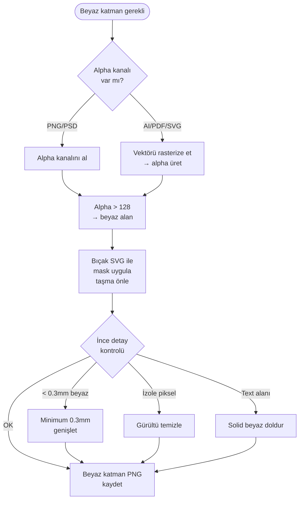
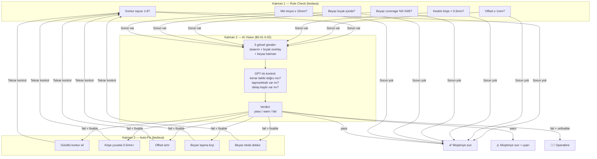
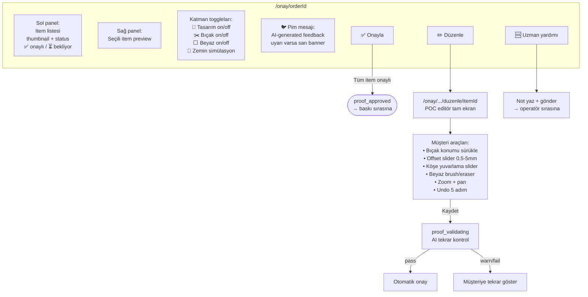
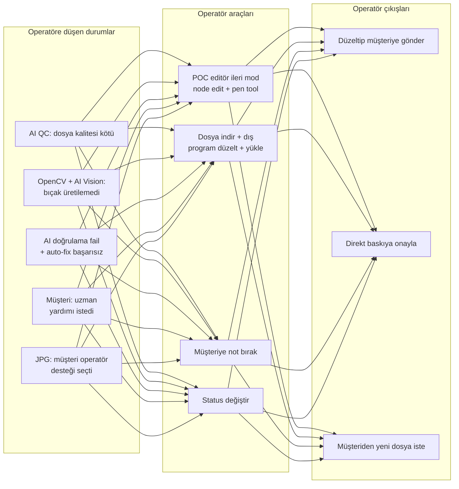
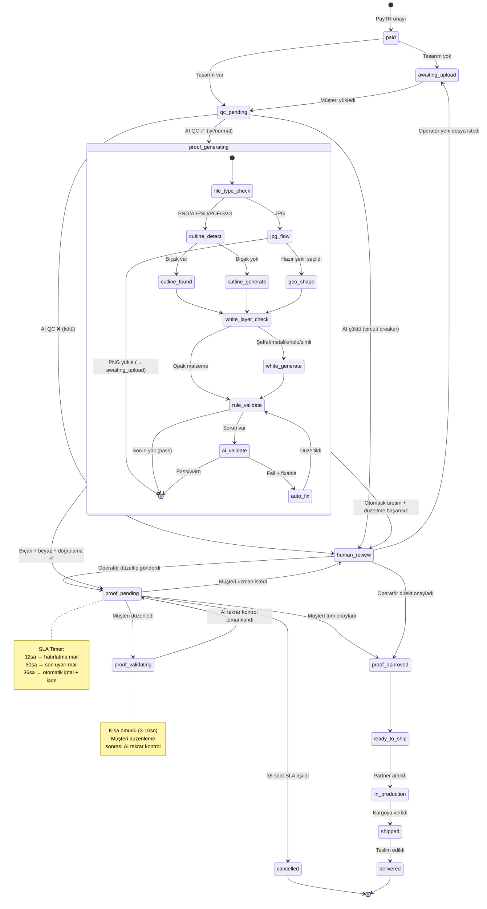
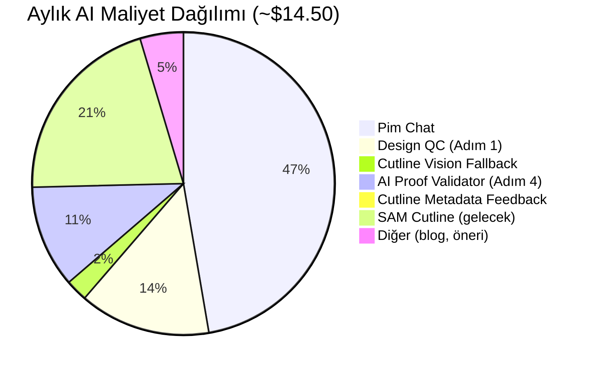

# Pim Etiket — Proof Editor & AI Validation Akış Şeması v3

> **Tarih:** 25 Mayıs 2026
> **Hazırlayan:** Claude Code (mimari)
> **Amaç:** Tasarım yükleme → bıçak + beyaz katman → AI doğrulama → müşteri/operatör kontrol → baskı

---

## Desteklenen Dosya Tipleri

| Dosya | Bıçak | Beyaz | AI QC | Grup |
|---|---|---|---|---|
| PNG | ✅ | ✅ | ✅ | İşlenebilir |
| AI | ✅ | ✅ | ✅ | İşlenebilir |
| PSD | ✅ | ✅ | ✅ | İşlenebilir |
| PDF | ✅ | ✅ | ✅ | İşlenebilir |
| SVG | ✅ | ✅ | ✅ | İşlenebilir |
| JPG | ❌ | ❌ | ✅ | Sadece QC + hazır şekil |

**EPS desteklenmez** — upload'da engellenir.

---

## Ana Akış (Mermaid)

```mermaid
flowchart TD
    Start([Müşteri sipariş verdi + ödeme tamam]) --> HasDesign{Tasarım<br/>yüklendi mi?}

    HasDesign -->|Evet| QC[🤖 ADIM 1<br/>AI Dosya QC<br/>GPT-4o Vision]
    HasDesign -->|Hayır| AwaitUpload[awaiting_upload<br/>Müşteri sonra yükler]
    AwaitUpload -->|Yükledi| QC

    QC --> QCResult{AI QC<br/>sonucu?}
    QCResult -->|✅ İyi / Normal| FileType{Dosya tipi?}
    QCResult -->|❌ Kötü| HumanReview[👨‍💼 OPERATÖR<br/>human_review]
    QCResult -->|💥 AI çöktü| HumanReview

    %% ===== DOSYA TİPİ AYIRIMI =====

    FileType -->|PNG AI PSD PDF SVG| CutlineCheck[⚙️ ADIM 2<br/>Bıçak tespiti]
    FileType -->|JPG| JpgFlow[⚠️ JPG AKIŞI<br/>Bıçak üretilemez]

    %% ===== JPG ÖZEL AKIŞI =====

    JpgFlow --> JpgChoice{Müşteri<br/>seçimi?}
    JpgChoice -->|PNG yükle| AwaitUpload2[awaiting_upload<br/>Yeni dosya bekle]
    AwaitUpload2 -->|PNG yükledi| QC
    JpgChoice -->|Hazır şekil seç| GeoShape[⚙️ Geometrik bıçak<br/>kare / daire / oval /<br/>dikdörtgen + offset]
    JpgChoice -->|Operatör yardımı| HumanReview
    GeoShape --> WhiteCheck

    %% ===== BIÇAK TESPİTİ =====

    CutlineCheck --> HasCutline{Dosyada<br/>bıçak var mı?}

    HasCutline -->|Var| ParseCut[Bıçağı parse et<br/>→ SVG path]
    HasCutline -->|Yok| AutoCut[⚙️ ADIM 2B<br/>Otomatik bıçak üret<br/>POC v2 OpenCV]

    ParseCut --> ValidateCut{Bıçak<br/>geçerli mi?}
    ValidateCut -->|✅ Kapalı + temiz| WhiteCheck
    ValidateCut -->|❌ Açık / bozuk| AutoCut

    AutoCut --> AutoCutResult{OpenCV<br/>başarılı?}
    AutoCutResult -->|Evet| WhiteCheck
    AutoCutResult -->|Hayır| VisionFallback[🤖 AI Vision Fallback<br/>GPT-4o ile kontur bul]
    VisionFallback --> VisionResult{Vision<br/>başarılı?}
    VisionResult -->|Evet| WhiteCheck
    VisionResult -->|Hayır| HumanReview

    %% ===== BEYAZ KATMAN =====

    WhiteCheck{ADIM 3<br/>Beyaz katman<br/>gerekli mi?}

    WhiteCheck -->|Şeffaf / Metalik<br/>Holo / Simli| GenWhite[⚙️ Beyaz katman üret<br/>Alpha → white mask<br/>Bıçak mask kırpma<br/>İnce detay genişletme]
    WhiteCheck -->|Kuşe / Kraft<br/>Opak PP / Beyaz| SkipWhite[Beyaz katman yok<br/>direkt doğrulamaya]

    GenWhite --> RuleCheck
    SkipWhite --> RuleCheck

    %% ===== AI DOĞRULAMA =====

    RuleCheck[⚙️ ADIM 4A<br/>Rule-based kontrol<br/>bedava + anında]

    RuleCheck --> RuleResult{Kural<br/>sonucu?}
    RuleResult -->|✅ Sorun yok| CustomerReady[proof_pending<br/>Müşteriye sun]
    RuleResult -->|⚠️ / ❌ Sorun var| AIValidate[🤖 ADIM 4B<br/>AI Vision doğrulama<br/>GPT-4o 3 görsel]

    AIValidate --> AIResult{AI<br/>sonucu?}
    AIResult -->|✅ Pass| CustomerReady
    AIResult -->|⚠️ Warn| CustomerWarn[proof_pending<br/>Müşteriye sun<br/>+ uyarı banner]
    AIResult -->|❌ Fail + düzeltilebilir| AutoFix[⚙️ ADIM 4C<br/>Otomatik düzeltme]
    AIResult -->|❌ Fail + düzeltilemez| HumanReview

    AutoFix --> FixResult{Düzeltme<br/>başarılı?}
    FixResult -->|Evet| ReValidate[Tekrar ADIM 4A<br/>max 2 deneme]
    FixResult -->|Hayır| HumanReview
    ReValidate --> RuleResult

    %% ===== MÜŞTERİ KONTROL =====

    CustomerReady --> CustomerView[👤 ADIM 5<br/>Müşteri prova kontrol<br/>/onay/orderId]
    CustomerWarn --> CustomerView

    CustomerView --> CustAction{Müşteri<br/>aksiyonu?}

    CustAction -->|✅ Onayla| ItemApproved{Tüm itemler<br/>onaylandı mı?}
    CustAction -->|✏️ Kendim düzenle| SelfEdit[👤 ADIM 5B<br/>POC Editör<br/>/onay/.../duzenle/itemId]
    CustAction -->|🆘 Uzman yardımı| HelpRequest[proof_help_request<br/>INSERT + not]

    SelfEdit --> SelfEditSave[Kaydet ve dön]
    SelfEditSave --> ProofValidating[proof_validating<br/>AI tekrar kontrol<br/>3-10 saniye]
    ProofValidating --> RuleCheck

    HelpRequest --> HumanReview

    ItemApproved -->|Hayır| CustomerView
    ItemApproved -->|Evet| ProofApproved[proof_approved]

    %% ===== SLA KONTROLÜ =====

    CustomerView -.->|12 saat| Reminder[📧 Hatırlatma mail]
    Reminder -.-> CustomerView
    CustomerView -.->|30 saat| LastWarn[📧 Son uyarı mail]
    LastWarn -.-> CustomerView
    CustomerView -.->|36 saat| AutoCancel[❌ Otomatik iptal<br/>+ PayTR iade]

    %% ===== OPERATÖR MÜDAHALESİ =====

    HumanReview --> OpAction{👨‍💼 Operatör<br/>aksiyonu?}

    OpAction -->|Düzeltip gönder| OpFix[Operatör düzeltir<br/>POC editör / Photoshop]
    OpAction -->|Direkt onayla| ProofApproved
    OpAction -->|Yeni dosya iste| AwaitUpload3[awaiting_upload<br/>Müşteriye mail]
    AwaitUpload3 -->|Yükledi| QC

    OpFix --> OpSend[Müşteriye<br/>tekrar gönder]
    OpSend --> CustomerView

    %% ===== BASKIYA İLETİM =====

    ProofApproved --> ReadyToShip[ready_to_ship]
    ReadyToShip --> AssignCheck{Auto-assign<br/>açık mı?}
    AssignCheck -->|Evet| AutoAssign[fn_find_best_partner<br/>Otomatik partner atama]
    AssignCheck -->|Hayır| ManualAssign[Admin manuel<br/>partner ata]
    AutoAssign --> Production[🖨️ in_production<br/>Partner üretir]
    ManualAssign --> Production
    Production --> Shipped[shipped<br/>Kargoya verildi]
    Shipped --> Delivered[delivered<br/>Teslim edildi]

    AutoCancel --> End([İşlem sonu])
    Delivered --> End

    %% ===== STİLLER =====

    classDef ai fill:#FF6B5B,stroke:#1F2A4D,color:#fff
    classDef system fill:#1F2A4D,stroke:#FF6B5B,color:#fff
    classDef customer fill:#34D399,stroke:#1F2A4D,color:#fff
    classDef operator fill:#FBBF24,stroke:#1F2A4D,color:#000
    classDef danger fill:#EF4444,stroke:#1F2A4D,color:#fff

    class QC,AIValidate,VisionFallback,ProofValidating ai
    class CutlineCheck,AutoCut,GenWhite,RuleCheck,AutoFix,ReValidate,GeoShape system
    class CustomerView,SelfEdit,CustomerReady,CustomerWarn customer
    class HumanReview,OpFix,OpSend operator
    class AutoCancel danger
```



---

## Detay Diyagramları

### Adım 2: Bıçak Tespiti (dosya tipine göre)

```mermaid
flowchart LR
    subgraph "Bıçak Tespit Yöntemleri"
        PNG[PNG dosya] -->|Alpha kanalı| AlphaEdge[Alpha > 0 alanın<br/>dış kenarı = bıçak]
        AI_file[AI dosya] -->|Layer tarama| SpotColor["CutContour" veya<br/>"Thru-cut" spot color<br/>layer → SVG path]
        PSD[PSD dosya] -->|Layer adı| LayerName["die" / "cut" / "knife"<br/>"bicak" layer → path export]
        PDF[PDF dosya] -->|İki yol| PDFPath["1. Spot color layer<br/>2. Vektör path (en dış)"]
        SVG[SVG dosya] -->|Direkt parse| SVGPath["clipPath / path<br/>elementi → bıçak"]
        JPG[JPG dosya] -->|❌| NoCut[Bıçak üretilemez<br/>→ hazır şekil veya<br/>PNG yükle]
    end
```

### Adım 3: Beyaz Katman Üretimi



### Adım 4: AI Doğrulama Detayı



### Adım 5: Müşteri Kontrol Ekranı



### Operatör Müdahale Noktaları



---

## Status Akış Diyagramı (State Machine)



---

## Maliyet Özeti (100 kullanıcı / 300 tasarım)



---

## Kural Tablosu Özet

| Adım | Aktör | Girdi | Çıktı | Maliyet |
|---|---|---|---|---|
| 1. Dosya QC | 🤖 GPT-4o | Ham dosya | iyi/normal/kötü | $0.01 |
| 2. Bıçak tespit | ⚙️ OpenCV | Dosya | SVG path | $0 |
| 2B. Bıçak üret | ⚙️ POC v2 | Dosya | SVG path | $0 |
| 2C. Vision fallback | 🤖 GPT-4o | Görsel | Kontur polygon | $0.01 |
| 3. Beyaz katman | ⚙️ Canvas | Alpha + bıçak | White PNG | $0 |
| 4A. Rule check | ⚙️ Kurallar | Bıçak + beyaz | pass/warn/fail | $0 |
| 4B. AI validate | 🤖 GPT-4o | 3 görsel | verdict + issues | $0.02 |
| 4C. Auto-fix | ⚙️ SVG/Canvas | Sorunlu proof | Düzeltilmiş proof | $0 |
| 5. Müşteri kontrol | 👤 | Proof preview | Onay/düzenle/yardım | $0 |
| 5B. Müşteri edit | 👤 POC | Editör | Düzeltilmiş bıçak | $0 |
| 6B. Operatör | 👨‍💼 | Sorunlu proof | Düzeltilmiş proof | $0 |
| 7. Baskıya ilet | ⚙️ | Onaylı paket | Manifest + iş emri | $0 |

---

> Bu diyagramları görmek için: VS Code'da "Markdown Preview Mermaid Support" extension'ı
> veya GitHub'da dosyayı aç (otomatik render).

*Hazırlayan: Claude Code (mimari) · 25 May 2026*
