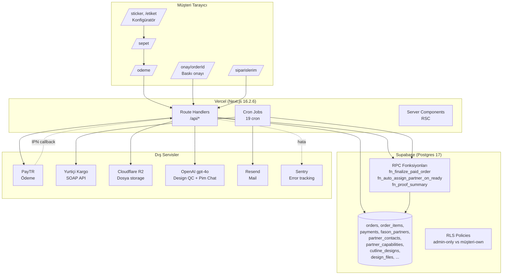
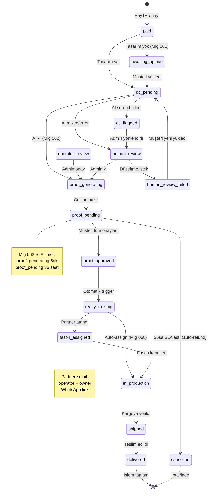
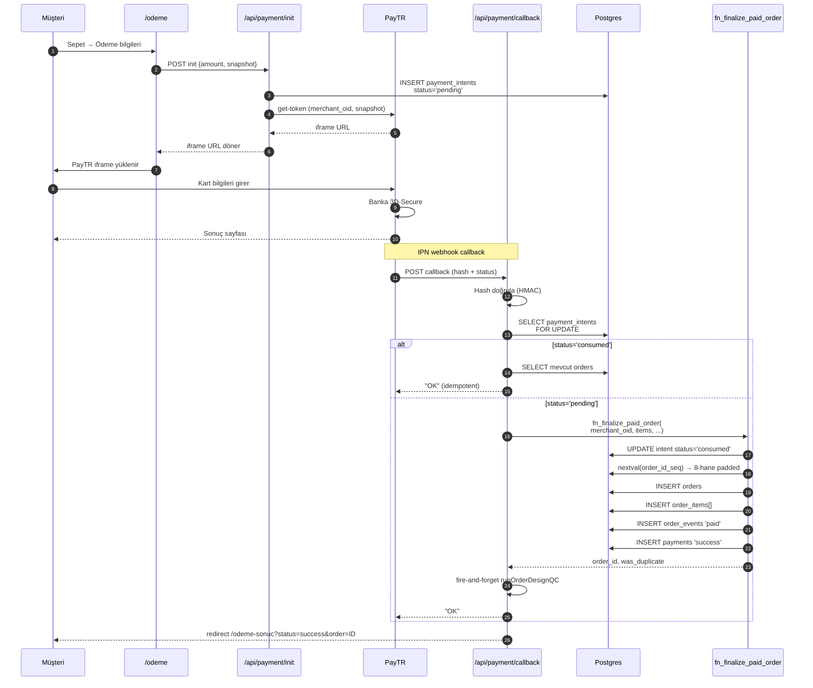
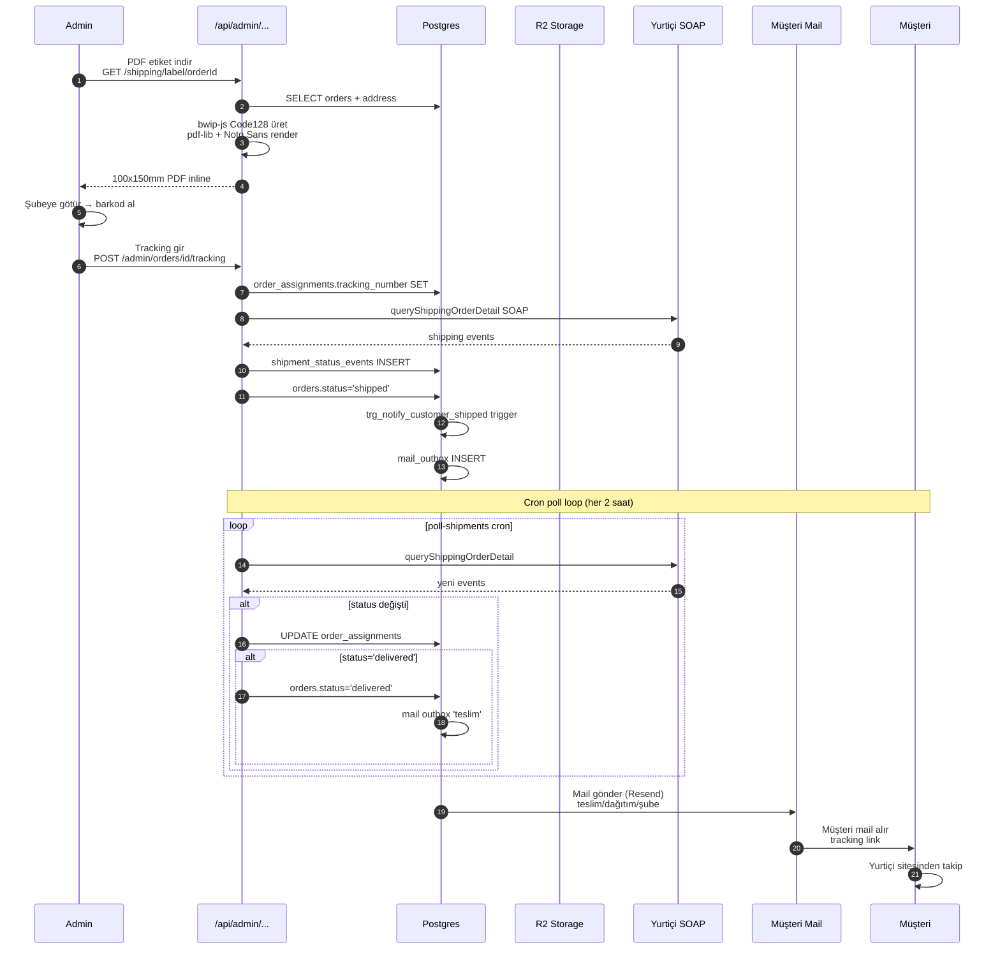
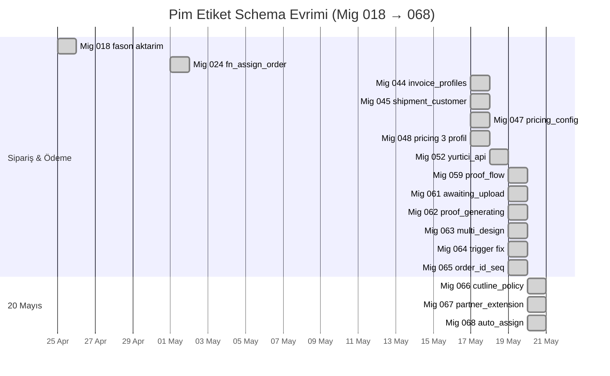

# Pim Etiket — Sistem Akış Şemaları

> Sistemin tüm ana akışları Mermaid diyagramları olarak.
> GitHub bu dosyayı otomatik renderlanır — diagramları görmek için dosyayı GitHub'da aç.
> Yerel olarak VS Code "Markdown Preview Mermaid Support" eklentisi ile görüntülenebilir.
>
> Sefa Yakut · 20 May 2026 · 19 commit / 5500+ satır iş sonrası tutarlı sistem.

---

## İçindekiler

1. [Mimari Genel Bakış](#1-mimari-genel-bakış)
2. [Müşteri Sipariş Akışı (E2E)](#2-müşteri-sipariş-akışı-e2e)
3. [Sipariş Status Flow (16 state)](#3-sipariş-status-flow-16-state)
4. [PayTR Ödeme Akışı](#4-paytr-ödeme-akışı)
5. [Tasarım Yükleme + AI QC](#5-tasarım-yükleme--ai-qc)
6. [Cutline + Prova Akışı](#6-cutline--prova-akışı)
7. [Üretim Partneri Otomatik Atama](#7-üretim-partneri-otomatik-atama)
8. [Kargo Akışı (Yurtiçi)](#8-kargo-akışı-yurtiçi)
9. [Fason / Partner Panel İş Kabul](#9-fason--partner-panel-iş-kabul)
10. [Admin Denetçi Cron Sistemi](#10-admin-denetçi-cron-sistemi)
11. [İade / Refund Akışı](#11-i̇ade--refund-akışı)
12. [Hata Kurtarma + Rollback Stratejisi](#12-hata-kurtarma--rollback-stratejisi)

---

## 1. Mimari Genel Bakış



**Stack özeti:** Next.js 16.2.6 (App Router, özel sürüm), React 19.2.4, TypeScript 5, Tailwind 4, Supabase (Postgres 17), Vercel Hosting, Cloudflare R2 cold storage, Resend mail, Sentry monitoring, PayTR ödeme, Yurtiçi Kargo (sözleşme bekleniyor).

---

## 2. Müşteri Sipariş Akışı (E2E)

Müşterinin ilk tıklamasından kargonun teslim edilmesine kadar tam akış.

```mermaid
flowchart TD
    Start([Müşteri /sticker veya /etiket'e gelir]) --> Config[Konfigüratör 5 step:<br/>Şekil/Kesim → Malzeme<br/>→ Yüzey → Boyut → Adet]
    Config --> Preview[Sol panelde canlı önizleme<br/>Sağda fiyat hesabı]
    Preview --> Upload{Tasarım yükle?}
    Upload -->|Evet| MultiDesign[Multi-design uploader<br/>1-50 tasarım]
    Upload -->|Sonra| SkipUpload[Sonra yüklerim<br/>checkbox]
    MultiDesign --> Cart[Sepete ekle]
    SkipUpload --> Cart
    Cart --> Sepet[/sepet]
    Sepet --> Odeme[/odeme<br/>Adres + Fatura + Ödeme]
    Odeme --> PayTR{PayTR onay?}
    PayTR -->|Başarısız| OdemeSonuc[/odeme-sonuc?status=fail]
    PayTR -->|Başarılı| Callback[/api/payment/callback<br/>fn_finalize_paid_order RPC]
    Callback --> Branch{Tasarım var mı?}
    Branch -->|Var| QC[orders.status='qc_pending'<br/>runOrderDesignQC fire-and-forget]
    Branch -->|Yok| AwaitUpload[orders.status='awaiting_upload']
    AwaitUpload --> TasUpload[/siparis/orderId/tasarim-yukle<br/>Müşteri dosya yükler]
    TasUpload --> QC
    QC --> AIVerdict{AI QC sonucu}
    AIVerdict -->|Tüm iyi| ProofGen[proof_generating<br/>5dk SLA]
    AIVerdict -->|Sorun| HumanReview[human_review<br/>operator inceler]
    HumanReview --> ProofGen
    ProofGen --> AutoCutline[POC v2 iframe<br/>otomatik cutline]
    AutoCutline --> ProofPending[proof_pending<br/>müşteri onayı bekleniyor]
    ProofPending --> CustOnay[/onay/orderId<br/>Müşteri her tasarımı onaylar]
    CustOnay --> SLA36{36 saat içinde<br/>onaylandı mı?}
    SLA36 -->|Hayır| AutoRefund[Otomatik iade<br/>auto-refund cron]
    SLA36 -->|Evet| ProofApproved[proof_approved]
    ProofApproved --> ReadyShip[ready_to_ship<br/>trigger]
    ReadyShip --> Partner{Auto-assign açık?}
    Partner -->|Evet| AutoAssign[trg_auto_assign_partner<br/>fn_find_best_partner]
    Partner -->|Hayır| ManualAssign[Admin /admin/siparisler/[id]<br/>manuel atama]
    AutoAssign --> Production[in_production<br/>fason üretir]
    ManualAssign --> Production
    Production --> Shipped[shipped<br/>Yurtiçi tracking aktif]
    Shipped --> Delivered[delivered]
    Delivered --> Review[/yorum-yaz/orderId<br/>request-reviews cron]
    OdemeSonuc --> End([Son])
    AutoRefund --> End
    Review --> End
```

**Kritik kontrol noktaları:**
- PayTR IPN duplicate guard: `fn_finalize_paid_order` `intent.status='consumed'` check
- Sequence-based order ID: `nextval('order_id_seq')` — çakışma imkansız (Mig 065)
- 36 saat SLA: `auto-refund` cron, `proof_pending`'de geçen süre

---

## 3. Sipariş Status Flow (16 state)

Tüm `order_status` enum değerleri ve geçişleri.



**State değişim tetikleyicileri:**
- `paid → awaiting_upload`: `fn_finalize_paid_order` snapshot'ta tasarım yoksa
- `paid → qc_pending`: `runOrderDesignQC` fire-and-forget sonrası
- `proof_approved → ready_to_ship`: `trg_proof_approved` trigger (Mig 059)
- `ready_to_ship → fason_assigned/in_production`: `trg_auto_assign_partner` (Mig 068, feature flag'li)

---

## 4. PayTR Ödeme Akışı

Müşteri "Ödemeyi tamamla" basınca başlayan SOAP-benzeri IPN akışı.



**Kritik kurallar:**
- **Idempotency**: IPN duplicate'i `intent.status='consumed'` check ile bloklanır, was_duplicate=true döner
- **Atomic**: `fn_finalize_paid_order` tek transaction, hata olursa rollback
- **Order ID format**: `nextval('order_id_seq')` → `LPAD(8, '0')` → `'00000123'` (Mig 065)
- **Hash doğrulama**: PayTR HMAC-SHA256, secret env'de

---

## 5. Tasarım Yükleme + AI QC

Müşteri tasarım yükler, AI gpt-4o ile kontrol edilir.

```mermaid
flowchart TD
    Start([Müşteri tasarım yükler]) --> Upload[/api/orders/orderId/upload-design<br/>multipart form]
    Upload --> Validate{Validation}
    Validate -->|Format/boyut sorunlu| Err400[400 Bad Request]
    Validate -->|OK| R2Upload[R2 storage upload<br/>key: designs/userId/orderId/file]
    R2Upload --> DBInsert[INSERT design_files<br/>status='uploaded'<br/>order_item_id link]
    DBInsert --> Trigger{Sipariş status?}
    Trigger -->|awaiting_upload| StatusUp[trigger:<br/>orders.status='qc_pending'<br/>Mig 061]
    Trigger -->|paid| StatusUp
    StatusUp --> QCRunner[runOrderDesignQC<br/>fire-and-forget<br/>Promise.allSettled paralel<br/>Mig P1]

    QCRunner --> ForEach[Her design_file için]
    ForEach --> SignedUrl[R2 signed URL 1 saat]
    SignedUrl --> OpenAI[OpenAI gpt-4o<br/>vision + structured output]
    OpenAI --> Verdict{Verdict}
    Verdict -->|iyi| Pass[design_quality_checks INSERT<br/>verdict='iyi']
    Verdict -->|normal| Mid[verdict='normal']
    Verdict -->|kotu| Fail[verdict='kotu']
    Verdict -->|exception| Err[verdict='error'<br/>Sentry captureException]

    Pass --> Aggregate[Tüm dosyalar bitti<br/>aggregate verdict]
    Mid --> Aggregate
    Fail --> Aggregate
    Err --> Aggregate

    Aggregate --> AllGood{Hepsi iyi?}
    AllGood -->|Evet| ProofGen[orders.status='proof_generating']
    AllGood -->|Hayır| HumanRev[orders.status='human_review'<br/>admin /admin/ai-qc inceler]

    ProofGen --> CutlineFlow[Cutline akışı<br/>bkz. §6]
    HumanRev --> AdminDecide{Admin kararı}
    AdminDecide -->|Onayla| ProofGen
    AdminDecide -->|Reddet| FailedAsk[human_review_failed<br/>müşteriye yeni yükleme]

    Err400 --> EndError([Müşteri tekrar dener])
    FailedAsk --> Start
```

**AI QC ne bakıyor:**
- DPI, çözünürlük, taşma (bleed)
- Kesim çizgisi varlığı (hasCutPath)
- Renk profili (CMYK vs sRGB)
- Text outline (font embed mi)
- Görsel kalite (blur, artifact)
- Gömülü raster sayısı

---

## 6. Cutline + Prova Akışı

POC v2 iframe orkestrasyon — müşteri tarayıcısında headless cutline.

```mermaid
flowchart TD
    Start([orders.status='proof_generating']) --> Onay[/onay/orderId<br/>Müşteri sayfası açılır]
    Onay --> Items[Sipariş items render]
    Items --> ForEachItem[Her item için]
    ForEachItem --> HiddenIframe[Hidden iframe<br/>/poc.html?embed=1&designUrl=...]
    HiddenIframe --> POC[POC otomatik:<br/>1. PDF/SVG yükle<br/>2. Material algıla<br/>3. White plan üret<br/>4. Cutline çiz]
    POC -->|postMessage 'pim-cutline-saved'| Parent[Parent /onay listener]
    Parent --> SaveAuto[POST /api/orders/.../save-edit<br/>cutline_designs INSERT<br/>status='auto_generated' Mig 062]
    SaveAuto --> AllReady{Tüm itemler hazır?}
    AllReady -->|Hayır| ForEachItem
    AllReady -->|Evet| ProofPending[trg_proof_pending<br/>orders.status='proof_pending'<br/>SLA 36sa başlar]

    ProofPending --> Display[Sol panel: item listesi<br/>Sağ panel: canlı önizleme<br/>+ cutline overlay]
    Display --> Action{Müşteri aksiyonu}
    Action -->|Onayla| ApproveOne[/api/orders/.../approve<br/>cutline_designs.status='approved']
    Action -->|Düzenle| EditPage[/onay/.../duzenle/itemId<br/>iframe POC tam ekran]
    Action -->|Yardım| HelpTicket[proof_help_requests INSERT<br/>operator inceler]

    EditPage --> POCEdit[POC manuel edit:<br/>Bıçak ayarları, beyaz plan, vb.]
    POCEdit -->|Kaydet ve dön| SaveEdit[POST /save-edit<br/>status='approved' direct]
    SaveEdit --> Return[/onay'a dön<br/>item onaylı]
    Return --> Action

    ApproveOne --> CheckAll{Tüm itemler onaylandı?}
    CheckAll -->|Hayır| Action
    CheckAll -->|Evet| Finalize[/api/orders/.../proof/finalize<br/>trg_proof_approved]

    Finalize --> Approved[orders.status='proof_approved']
    Approved --> ReadyShip[trigger:<br/>orders.status='ready_to_ship']
    ReadyShip --> PartnerFlow[Üretim Partneri akışı<br/>bkz. §7]
    HelpTicket --> AdminFix[/admin/prova<br/>operator çözer]
    AdminFix --> Display
```

**POC iframe protokolü:**
- Parent → iframe: `?orderId=X&designUrl=Y&embed=1` query params
- iframe → Parent: `postMessage({type: 'pim-cutline-saved', svg, png, meta})`
- Embed modu: upload + export panelleri gizli (Sefa 19 May commit)

---

## 7. Üretim Partneri Otomatik Atama

`ready_to_ship`'e geçince partner'a otomatik atama + mail.

```mermaid
flowchart TD
    Start([orders.status='ready_to_ship']) --> Trigger[trg_auto_assign_partner<br/>Mig 068]
    Trigger --> Flag{site_settings.<br/>partner_auto_assign_enabled?}
    Flag -->|false| Manual[/admin/siparisler/[id]<br/>Sefa manuel atar]
    Flag -->|true| Existing{Aktif atama var mı?}
    Existing -->|Var| NoOp[no-op<br/>partial unique index korur]
    Existing -->|Yok| FirstItem[İlk order_item al]
    FirstItem --> MapCap[fn_map_item_to_capability<br/>meta.material → capability_value]
    MapCap --> Mapping{Material türü}
    Mapping -->|vinil/opakpp/kuse| Paper[product_type + 'paper']
    Mapping -->|transparan/seffaf/ultra| Trans[product_type + 'transparent']
    Mapping -->|holo| Holo[product_type + 'holographic']
    Mapping -->|simli/metalik| Metal[product_type + 'metallic']
    Mapping -->|bilinmeyen| Unknown[material=null<br/>filter atla]

    Paper --> Find[fn_find_best_partner]
    Trans --> Find
    Holo --> Find
    Metal --> Find
    Unknown --> Find

    Find --> Query[SELECT fason_partners WHERE<br/>status='active'<br/>+ capability product_type<br/>+ capability material<br/>+ min_order_amount<br/>ORDER cached_score DESC<br/>+ default_lead_days ASC]
    Query --> Found{Eligible var mı?}
    Found -->|Yok| ManualFallback[no-op<br/>admin /admin/siparisler/[id]<br/>manuel atar]
    Found -->|Var| Top1[En üstteki partner]

    Top1 --> Assign[fn_assign_order_to_fason<br/>Mig 024 — ATOMIC]
    Assign --> AssignTx[BEGIN]
    AssignTx --> InsertAssign[INSERT order_assignments<br/>status='assigned']
    InsertAssign --> Token[fason_token üret<br/>14 gün TTL]
    Token --> MailQueue[mail_outbox INSERT<br/>operator + owner mailleri]
    MailQueue --> EventLog[order_events INSERT]
    EventLog --> Commit[COMMIT]

    Commit --> Cron[process-mail-outbox cron<br/>günde 1 (Hobby plan)<br/>veya */15 Pro]
    Cron --> Resend[Resend API call]
    Resend --> Sent[Mail gönderildi]
    Sent --> PartnerLink[/fason/[token]<br/>Partner kabul/red ekranı]

    Manual --> ManualAssign[Admin /admin/siparisler/[id]<br/>Fason'a gönder kartı]
    ManualAssign --> Assign

    ManualFallback --> Manual
    NoOp --> End([no-op tamamlandı])
    PartnerLink --> End2([Partner aksiyon bekleniyor])
```

**Kapasiteler haritası:**

| Material ID | Capability Value |
|---|---|
| vinil, opak, opakpp, beyaz | `paper` |
| transparan, seffaf, ultra, ultraclear | `transparent` |
| holo, holografik | `holographic` |
| simli, metalik, metalize | `metallic` |
| kuse, kraft, kuşe | `paper` |

---

## 8. Kargo Akışı (Yurtiçi)

Etiket → tracking → durum sync → müşteri bildirimi.



**Kargo akışı 2 mod:**
- **Faz A** (şu an, sözleşme öncesi): Sefa şubeye götürür, manuel barkod alır, AdminTrackingForm'a girer
- **Faz B** (sözleşme + credentials gelince): `createShipment` SOAP otomatik, tracking_number döner, sıfır manuel adım

---

## 9. Fason / Partner Panel İş Kabul

Partner mail alıp /fason/[token] linkine tıklayınca.

```mermaid
flowchart TD
    Start([Partner mail aldı]) --> Click[/fason/[token]<br/>tıklar]
    Click --> Auth[Token validate<br/>fason_assignments JOIN]
    Auth -->|Geçersiz/expired| Reject[403 Forbidden]
    Auth -->|Geçerli| Display[Sipariş detay sayfa<br/>items + kargo adresi<br/>cutline SVG'leri imzalı URL]

    Display --> ManifestDL[/api/admin/print-job/[orderId]/manifest<br/>JSON paket + SVG signed URL'leri<br/>RIP sistemine alınabilir]

    Display --> Action{Partner aksiyon}
    Action -->|Kabul et| Acknowledge[POST /fason/update<br/>status='acknowledged']
    Action -->|Sorun bildir| Issue[POST /fason/issue<br/>issue_category + photo]
    Action -->|İptal| Cancel[POST /fason/cancel<br/>+ reason]

    Acknowledge --> Production[status='in_production'<br/>partner üretir]
    Production --> Ready[POST /fason/update<br/>status='ready']
    Ready --> Shipped[POST /fason/update<br/>status='shipped' + tracking_number]
    Shipped --> KargoFlow[Kargo akışı bkz. §8]

    Issue --> AdminAlert[Admin /admin/siparisler<br/>issue rozeti + bildirim]
    AdminAlert --> AdminResolve[Sefa partner ile iletişim]
    AdminResolve --> Display

    Cancel --> ReAssign[Sipariş başka partner'a<br/>manuel atanır]
    ReAssign --> NewMail[Yeni partner mail alır]
    NewMail --> Click
    Reject --> End([Son])
    KargoFlow --> End
```

---

## 10. Admin Denetçi Cron Sistemi

9 auditor + 1 daily-digest günlük/haftalık otomatik denetim.

```mermaid
flowchart TB
    subgraph "Vercel Cron Scheduler"
        C1[security - 01:00 günlük]
        C2[finance - 21:00 günlük]
        C3[workflow - 05:00 günlük]
        C4[compliance - 10:30 günlük]
        C5[ai_cost - 09:30 günlük]
        C6[data_hygiene - Pazar 03:00]
        C7[customer_health - Pazartesi 10:00]
        C8[seo - Çarşamba 11:00]
        C9[brand - Cuma 14:00]
        CD[daily-digest - 08:00 her gün]
    end

    subgraph "Auth"
        Auth[CRON_SECRET<br/>Bearer header<br/>timing-safe compare]
    end

    C1 --> Auth
    C2 --> Auth
    C3 --> Auth
    C4 --> Auth
    C5 --> Auth
    C6 --> Auth
    C7 --> Auth
    C8 --> Auth
    C9 --> Auth
    CD --> Auth

    Auth --> Run[Auditor.run]
    Run --> Fetch[Supabase service role<br/>kapsamlı veri çek]
    Fetch --> LLM[OpenAI gpt-4o-mini veya 4o<br/>structured output - Zod]
    LLM --> Findings[Bulgular + öneriler]
    Findings --> Save[auditor_runs INSERT<br/>+ auditor_findings]
    Save --> Notify{Severity=high?}
    Notify -->|Evet| Alert[mail_outbox INSERT<br/>AUDITOR_NOTIFY_EMAILS]
    Notify -->|Hayır| LogOnly[sadece audit log]

    CD --> Aggregate[Tüm auditor son run'larını topla]
    Aggregate --> SummaryLLM[Özet LLM - Anthropic Claude]
    SummaryLLM --> DigestMail[Resend daily digest<br/>Sefa'ya]
    Alert --> Mail[Resend]
    LogOnly --> End([Loglanır])
    DigestMail --> Mail
    Mail --> Sefa([Sefa mail alır])
```

**Auditor görev haritası:**

| Auditor | Görev |
|---|---|
| security | RLS, auth, secret leak, API güvenlik |
| finance | Gelir/iade/refund/fatura tutarlılık |
| workflow | Sipariş akışı tıkanıklık (paid 24sa+, vb.) |
| compliance | KVKK, mesafeli satış yönetmeliği |
| ai_cost | OpenAI/Anthropic harcaması, optimizasyon önerisi |
| data_hygiene | Stale data, orphan kayıt, eski tasarımlar |
| customer_health | Müşteri risk skoru, churn sinyali |
| seo | Sayfa SEO denetimi, metadata, structured data |
| brand | Marka tutarlılığı, Pim mascot kullanımı |

---

## 11. İade / Refund Akışı

3 farklı iade senaryosu.

```mermaid
flowchart TD
    Start([İade tetikleyici]) --> Type{Tip?}

    Type -->|36sa SLA aştı| AutoRefund[auto-refund cron<br/>günde 1 çalışır]
    Type -->|Müşteri talep| Manual[/iade-talep<br/>müşteri form doldurur]
    Type -->|Operatör| AdminRefund[/admin/iadeler<br/>Sefa manuel başlatır]

    AutoRefund --> SLACheck[proof_pending<br/>now() - status_at > 36h]
    SLACheck --> SLAFound{Süre aşan var mı?}
    SLAFound -->|Yok| EndSilent([no-op])
    SLAFound -->|Var| ProcessAuto[Her sipariş için:<br/>1. orders.status='cancelled'<br/>2. payments refund]

    Manual --> Ticket[refund_requests INSERT<br/>status='pending']
    Ticket --> AdminReview[/admin/iadeler<br/>Sefa inceler]

    AdminRefund --> RefundForm[Sebep + tutar belirt]
    RefundForm --> ProcessManual[refund_requests INSERT<br/>status='approved']

    ProcessAuto --> PSPRefund[PayTR refund API call]
    ProcessManual --> PSPRefund
    AdminReview -->|Onayla| PSPRefund
    AdminReview -->|Reddet| RejectMail[Müşteriye red maili]

    PSPRefund --> PSPSuccess{PSP onayı?}
    PSPSuccess -->|Başarısız| ManualEscalate[Sefa manuel banka<br/>iade işlemi]
    PSPSuccess -->|Başarılı| PaymentUpdate[payments INSERT<br/>action='refund' status='success']

    PaymentUpdate --> Notify[Müşteriye mail<br/>iade onayı]
    Notify --> StatementUpdate[Finans kayıt güncelle]
    StatementUpdate --> End([Tamamlandı])
    RejectMail --> End
    ManualEscalate --> End
    EndSilent --> End
```

---

## 12. Hata Kurtarma + Rollback Stratejisi

Her kritik akışta "şu çökerse ne olur" planı.

```mermaid
flowchart TD
    Error([Hata oluştu]) --> Type{Hata türü}

    Type -->|Vercel build fail| BuildFail[Atomik geçiş yapılmaz<br/>eski sürüm canlı kalır]
    BuildFail --> InstantRB[Vercel UI<br/>Instant Rollback]

    Type -->|DB migration fail| DBFail[Transaction rollback<br/>Postgres otomatik]
    DBFail --> RollbackSQL[Manual fix SQL<br/>veya Supabase backup]

    Type -->|PayTR IPN duplicate| IPNDup[fn_finalize_paid_order<br/>was_duplicate=true döner]
    IPNDup --> IdempotentOK[Mevcut order_id ile<br/>OK yanıtı]

    Type -->|AI QC timeout| QCFail[verdict='error' kaydı<br/>order paid'de kalır]
    QCFail --> ManualQC[/admin/ai-qc<br/>Sefa manuel re-run]

    Type -->|Mail outbox kuyruk fail| MailFail[exponential backoff<br/>5/15/45/120/360/720 dk]
    MailFail --> RetryUntil[6. denemede dead-letter]

    Type -->|Cutline POC iframe çöker| POCFail[/onay sayfasında<br/>loadError state]
    POCFail --> POCRetry[Manuel retry butonu<br/>veya /duzenle tam ekran]

    Type -->|Yurtıçi SOAP down| SOAPFail[poll-shipments cron<br/>fail kayıt + Sentry]
    SOAPFail --> NextPoll[Sonraki cron'da retry<br/>2 saat sonra]

    Type -->|Partner atama fail| PartnerFail[trigger exception<br/>sessiz no-op]
    PartnerFail --> ManualAssign[Admin /admin/siparisler<br/>manuel atar]

    Type -->|Vercel function timeout| FuncTO[maxDuration aşıldı<br/>response yok]
    FuncTO --> Retry[Müşteri tarafı retry<br/>idempotent endpoint]

    Type -->|Sentry alert| SentryAlert[Sefa Slack/mail bildirim]
    SentryAlert --> Investigate[Stack trace + bağlam<br/>fix push + auto deploy]

    InstantRB --> Recovered([Eski sürüm canlı])
    RollbackSQL --> Recovered
    IdempotentOK --> Recovered
    ManualQC --> Recovered
    RetryUntil --> Recovered
    POCRetry --> Recovered
    NextPoll --> Recovered
    ManualAssign --> Recovered
    Retry --> Recovered
    Investigate --> Recovered
```

**Backup + recovery noktaları:**
- **DB:** Supabase otomatik 7-gün PITR (Point-in-Time Recovery)
- **R2:** Versioning kapalı, silinen restore edilemez — kritik tasarımlar `archived_designs` tablosuna log
- **Order ID:** sequence-based, "atlanan" numara olmaz, çakışma imkansız
- **Sentry:** Her unexpected exception captureException + tags ile filtreli

---

## Ek: Migration Sırası (Schema Evrimi)



---

## Anayasa Kuralları (Akış Referansı)

Bu akışların hepsi aşağıdaki kurallara uygundur:

1. **Pim tek karakter** — chat + mascot, persona dropdown yok
2. **36 saat SLA** — proof_pending'de geçen süre, otomatik iade
3. **Sequence order ID** — çakışma imkansız, 8-hane padded
4. **Cüzdan vizyonu yok** — kredi/bakiye sistemi yok, kupon ile iyi niyet
5. **POC fiyata etki etmez** — cutline maliyeti her zaman 0
6. **AI maili Resend, insan maili Gmail Workspace**
7. **İlk 3 ay reklam: mikro-influencer barter** — sıfır cash
8. **Sosyal medya ana mecra: Instagram**

---

*Hazırlayan: Claude · 20 May 2026*
*Sürüm: 1.0 — pre-launch öncesi sistem tam haritası*
*Sonraki revizyon: Paraşüt entegrasyonu sonrası + Yurtıçi prod handshake sonrası*
