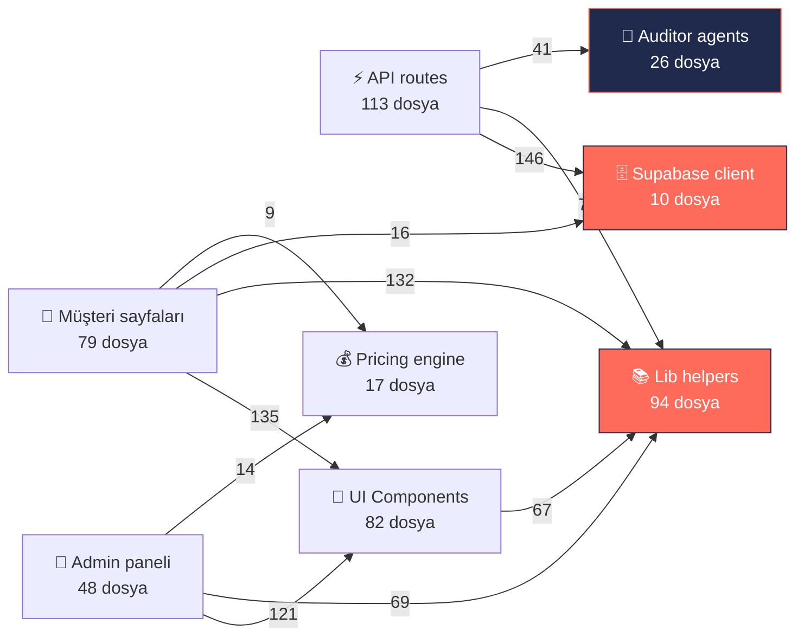
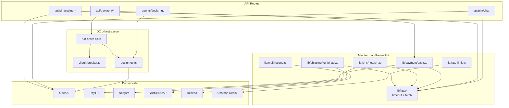

# 🧠 Pim Etiket — Sistem Bağımlılık Haritası

> **Üretim tarihi:** 21 Mayıs 2026 v68
> **Yöntem:** `madge` ile statik TS/TSX import analizi (469 dosya, 670+ ilişki)
> **Yeniden üretmek için:** [Aşağıdaki "Yeniden üretme" bölümüne](#-yeniden-üretme) bak

Bu doküman Pim Etiket codebase'inin sinir ağı haritasını çıkarır — hangi
modül kime bağlı, omurga neresi, ölü kod nerede.

---

## 1️⃣ Mimari — katman akışı



**Bağımlılık akışı tek yönlü ve sağlıklı:**
`pages → components → lib → supabase`. Hiyerarşi temiz, layer cycle yok.

---

## 2️⃣ Kritik Hub'lar — en çok import EDİLEN 15 dosya

Bu dosyalardan birine dokunmak, bağlı tüm dosyaları potansiyel olarak
etkiler. Değişiklik öncesi geniş regression testi şart.

| Sıra | İmport sayısı | Dosya | Notu |
|------|---------------|-------|------|
| 1 | **96** | `components/ui/index.ts` | UI barrel — Button/Card/Input/Toast |
| 2 | **91** | `components/Icon.tsx` | Icon set — her sayfa kullanıyor |
| 3 | **90** | `lib/cn.ts` | Tailwind classname birleştirici (3 satır) |
| 4 | **57** | `lib/supabase/admin.ts` | Service role client — admin API'ler |
| 5 | **52** | `components/Pim.tsx` | Maskot component |
| 6 | **51** | `lib/supabase/server.ts` | Server-side anon client |
| 7 | **46** | `lib/supabase/assert-admin.ts` | Admin guard — 46 endpoint güvenlik |
| 8 | **35** | `lib/i18n/context.tsx` | TR/EN locale provider |
| 9 | **30** | `lib/agents/_shared/types.ts` | Auditor type definitions |
| 10 | **28** | `lib/supabase/client.ts` | Browser anon client |
| 11 | **23** | `lib/customer-cart.ts` | Sepet state — localStorage + DB sync |
| 12 | **22** | `lib/customer-order.ts` | Sipariş state |
| 13 | **15** | `lib/supabase/auth-bridge.ts` | Auth → user state köprüsü |
| 14 | **15** | `lib/storage/design-files.ts` | Tasarım dosyası storage |
| 15 | **14** | `lib/pricing-engine/index.ts` | Fiyat motoru entry |

**Tek cümle özetle:** Sistem omurgası 7 dosyada toplanır
(`cn`, `ui/index`, `Icon`, Supabase × 4) — bunlardan birini bozarsan
250+ dosya etkilenir.

---

## 3️⃣ Mega-component'lar — en çok import EDEN 10 dosya

Bu dosyalar refactor adayı — tek dosyada çok sorumluluk taşıyor.

| İmport adedi | Dosya | Satır | Risk |
|--------------|-------|-------|------|
| **24** | `app/etiket/yapilandir/page.tsx` | 3037 | 🔴 Yüksek — değişim regression riski |
| **24** | `app/sticker/yapilandir/page.tsx` | 2709 | 🔴 Yüksek |
| **19** | `components/ui/index.ts` | (barrel) | 🟢 Sağlıklı |
| **16** | `app/admin/fiyat-hesapla/page.tsx` | — | 🟡 Orta |
| **16** | `app/odeme/page.tsx` | 2042 | 🔴 Yüksek |
| **16** | `app/siparis/[id]/page.tsx` | 1028 | 🟡 Orta |
| **13** | `app/admin/fiyat-hesapla-etiket/page.tsx` | — | 🟡 Orta |
| **12** | `lib/agents/_shared/proposal.ts` | — | 🟡 Circular dep merkezi |
| **12** | `lib/mail/notifications.ts` | — | 🟢 Mail orchestrator |
| **11** | `app/api/admin/auditors/[name]/run/route.ts` | — | 🟢 Agent çalıştırıcı |

**Aksiyon:** Agent denetimi #3'te de tespit edilen 4 mega-component
(`etiket/yapilandir`, `sticker/yapilandir`, `odeme`, `siparis/[id]`)
500-600 satırlık alt parçalara bölünmeli.

---

## 4️⃣ Topoloji özeti

| Metrik | Sayı | Yorum |
|--------|------|-------|
| Toplam modül | 474 | — |
| **Entry point** (kimse import etmez, eder) | 206 | Pages + API routes (Next.js auto-discovery) |
| **Yaprak** (import eder yok, edilir) | 70 | Sabitler, types, helpers — sağlıklı |
| **İzole** (0 in, 0 out) | 40 | Type-only declarations + dev tools |
| **Hub** (≥10 import alan) | 20 | Omurga |
| **Circular dep** | 10 | Tümü agent altyapısında — kasıtlı pattern |

### Katman dağılımı

```
113  api/         (API routes)
 94  lib/         (helpers, utilities)
 82  component/   (UI components)
 79  page/        (müşteri sayfaları)
 48  admin/       (admin paneli)
 26  agent/       (auditor system)
 17  pricing/     (fiyat motoru)
 10  supabase/    (DB client)
  5  other/       (root configs)
```

### Katman-arası en yoğun 10 bağlantı

| FROM | TO | COUNT |
|------|-----|-------|
| api | supabase | **146** |
| page | component | **135** |
| page | lib | **132** |
| admin | component | **121** |
| component | component | **103** |
| api | lib | **71** |
| admin | lib | **69** |
| component | lib | **67** |
| lib | lib | **59** |
| agent | agent | **45** |

**Yorum:** API → Supabase 146 bağlantı — beklenen (her endpoint DB sorgusu).
Page → Component 135 — UI yoğun. Component → Component 103 ve Lib → Lib 59
healthy composition pattern'i.

---

## 5️⃣ Circular Dependency (10 adet)

Hepsi aynı şablon:
```
lib/agents/_shared/proposal.ts ↔ lib/agents/actions/<X>.ts
```

10 action dosyası `proposal.ts`'ten `ProposalResult` tipini import eder,
`proposal.ts` da action registry'yi import eder → cycle.

**Tehlikeli değil** (type-only re-export), ama BEKLEYEN-ISLER için
çözüm önerisi:

```
proposal.ts        → proposal-types.ts (sadece types)
                   → proposal-registry.ts (action map)
```

**Çaba:** 30 dakika, sıfır business risk.

---

## 6️⃣ Dead code adayları (8 gerçek + 3 false positive)

`grep` ile hiçbir dosyada import edilmeyen modüller:

### Gerçek aday (silinebilir, ~200-500 satır ölü kod)

```
[components — 5 dosya]
  ProductInfoSection.tsx                       (eski layout artığı?)
  home/FloatingStickers.tsx                    (anasayfa eski animasyon)
  home/QuickReorderWidget.tsx                  (kaldırılmış)
  sticker/TabakaPreview.tsx                    (StickerLivePreview'a entegre)
  storage/RestoreArchivedFileButton.tsx

[lib — 2 dosya]
  format/price.ts                              (cn.ts veya başkasıyla replace)
  mail/templates/order-upload-reminder.tsx     (cron import etmiyor?)

[supabase — 1 dosya]
  lib/supabase/role.ts                         (assert-admin.ts'e taşındı?)
```

### False positive (Next.js auto-uses — silmeyin!)
```
app/error.tsx          (Error boundary)
app/not-found.tsx      (404 handler)
app/sitemap.ts         (SEO sitemap)
```

---

## 7️⃣ Genel sağlık değerlendirmesi

| Kriter | Durum | Not |
|--------|-------|-----|
| **Bağlantı sıhhati** | ✅ Çok iyi | Tek yönlü, layer hiyerarşisi temiz |
| **Hub konsantrasyonu** | ✅ Sağlıklı | 20 hub × ort. 30 import = dengeli |
| **Circular dep** | 🟡 10 kasıtlı | Type/registry ayrımı ile sıfırlanır |
| **Dead code** | 🟡 8 dosya | Silinmeye hazır, 1 saat iş |
| **Mega-component** | 🔴 4 dosya | Refactor sırasında — agent #3 |

---

## 🔄 Yeniden Üretme

Sefa istediği zaman bu raporu güncel halde yeniden çıkarabilir:

```powershell
cd core/storefront

# 1) Bağımlılık JSON'unu üret (~5 saniye)
npx madge --json --extensions ts,tsx --ts-config tsconfig.json src/ > deps.json

# 2) Analiz scriptini çalıştır (özet + Mermaid + dead code)
python scripts/analyze-deps.py

# 3) Sadece orphan / dead code listesi
npx madge --orphans --extensions ts,tsx --ts-config tsconfig.json src/

# 4) Sadece circular dependency
npx madge --circular --extensions ts,tsx --ts-config tsconfig.json src/

# 5) Görsel graph (SVG/PNG — graphviz gerekli)
npx madge --image deps.svg --extensions ts,tsx --ts-config tsconfig.json src/
```

**`deps.json`** her çalıştırmada yeniden üretildiği için `.gitignore`'da.
Sadece bu döküman ve `scripts/analyze-deps.py` versiyon kontrolünde.

---

## 📝 Notlar

- **Madge** Next.js path alias (`@/...`) için `tsconfig.json` üzerinden
  resolve eder; ek config gerekmez.
- Bu analiz **statik** — runtime'da dynamic import edilen modüller
  (örn `import("...")`) graph'a girer ama lazy load tespit edilmez.
- "Dead code" tespiti manuel doğrulama gerektirir: bazı dosyalar
  sadece test/script tarafından import edilmiş olabilir.

---

## 8️⃣ Dış API entegrasyon katmanı (agent bağlamı)

> **Detay:** `docs/API-INTEGRATION-FIXES.md` · **Smart Context domain:** `integrations`
> **Cursor rule:** `.cursor/rules/integrations.mdc`



**Agent tetikleme:**

| Dosya / konu | `npm run context -- --path` sonucu |
|--------------|----------------------------------|
| `src/lib/payment/paytr.ts` | order + **integrations** |
| `src/lib/http/*` | **integrations** |
| `src/app/api/payment/callback` | order + integrations |
| `src/lib/agents/run-order-qc.ts` | agents + order + integrations |

**Kural:** Yeni dış HTTP → `fetchWithTimeout` + `external-timeouts.ts` sabiti.

---

**Versiyon geçmişi**
- v1.0 — 21.05.2026 — İlk üretim. 474 modül, 10 circular dep, 8 dead code.
