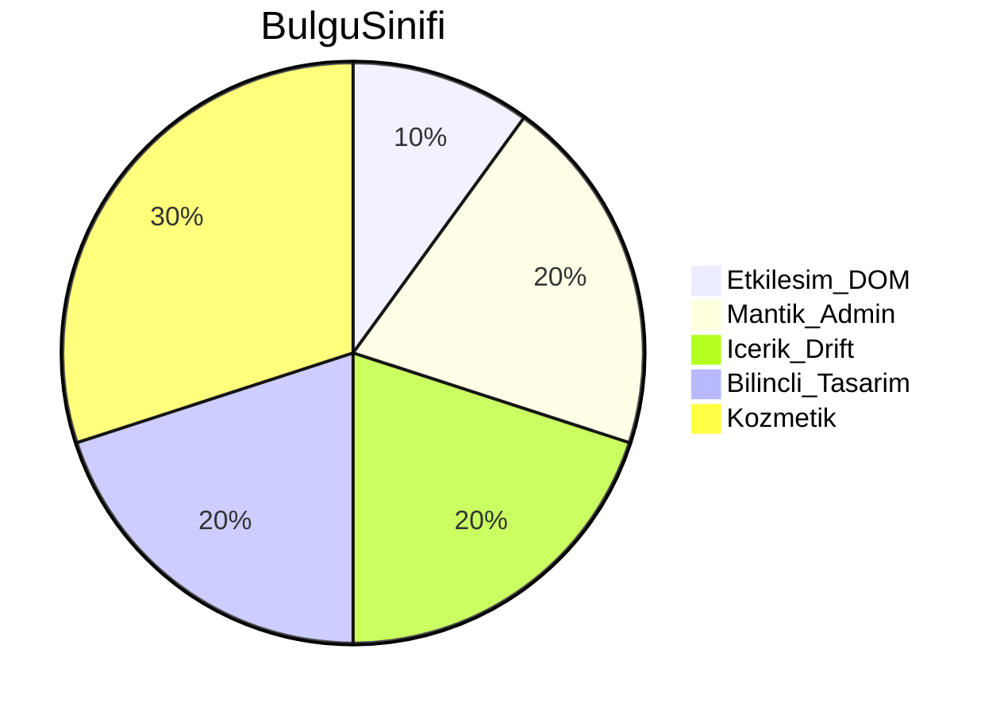

# Etiket & Sticker — Ürün Bazlı Negatif Analiz Raporu

> **Tarih:** 31 Mayıs 2026  
> **Kapsam:** 22 ürün kartı (`/etiket` 11 + `/sticker` 11), yapılandırıcı akışları, grid, fiyat, sepet/editör kesişimleri  
> **Yöntem:** Statik kod + `scripts/product-configurator-audit.mjs` + Playwright `product` projesi (26 test, production `pimetiket.com`) + doküman cross-check  
> **Baseline:** [`docs/urun-akisi-tam.md`](./urun-akisi-tam.md), [`CURSOR-GOREVLER-BUG-TARAMA.md`](../CURSOR-GOREVLER-BUG-TARAMA.md)

---

## 1. Executive Summary

| Metrik | Değer |
|--------|-------|
| **P0** (sayfa kırık / sepete eklenemez / geçersiz DOM) | 0 |
| **P1** (yanıltıcı UI, duplicate id, kilit zinciri riski) | 2 |
| **P2** (içerik drift, admin sync, bilinçli eksikler) | 5 |
| **P3** (kozmetik, dokümantasyon) | 3 |
| 22 ürün yapılandırıcı smoke (fiyat + adım UI) | **22/22 geçti** |
| Grid link sayısı (11+11) | **Geçti** |
| Statik step DOM sırası (etiket rulo + sticker) | **Uyumlu** |
| Pricebook unit test | **Geçti** |
| Sarım lock-chain unit test | **Geçti** |
| Runtime E2E tam interaksiyon (mobil, sepete ekle) | Kısmi — auth/env gerekli akışlar manuel |

### Top 5 acil fix

1. ~~**P1** — `?form=&shape=bumper`: duplicate `#step-3`~~ → **Düzeltildi** (i18n hydrated guard + boş `form=` URL sanitize).
2. ~~**P1** — Yuvarlak rulo malzeme adları drift~~ → **Düzeltildi** (müşteri UI MATERIALS const; Mig 126 admin sync).
3. ~~**P2** — Sticker sheet kart DB başlık~~ → **Düzeltildi** (Mig 082 apply script çalıştırıldı).
4. ~~**P2** — Kiss-cut fiyat diecut map~~ → **UI notu eklendi** (PriceCard üstü bilgilendirme).
5. **P2** — Kesim/şekil picker'ları gizli — bilinçli tasarım (değişmedi).

---

## 12. Fix oturumu (31 May 2026 — uygulama)

| Fix | Dosya / araç |
|-----|----------------|
| Hydration guard | `i18n/context.tsx` (`hydrated`), etiket + sticker yapilandir skeleton |
| Boş `?form=` temizleme | `use-sanitize-empty-query-param.ts` |
| Malzeme adları tutarlı | `etiket/yapilandir` — admin name yerine MATERIALS const |
| Kiss-cut bilgi | `sticker/yapilandir` — PriceCard üstü not |
| DB sheet başlık | `082_sticker_sheet_rename.sql` + `apply-migrations-082-126.mjs` |
| Admin malzeme adları | `126_etiket_rulo_material_display.sql` |
| E2E | **26/26** `npm run bot:product` geçti |

---

## 2. 22 Ürün Durum Matrisi

| ID | Ürün | Runtime smoke | Adım sırası | Fiyat | Not |
|----|------|---------------|-------------|-------|-----|
| E1 | Özel Kesim Rulo | OK | 7 adım | OK | Sarım 4→5 tabaka'da yok |
| E2 | Şeffaf Rulo | OK | OK | OK | `shape=clear` → seffaf pre-fill |
| E3 | Yuvarlak Rulo | OK | OK | OK | P2 malzeme ad drift riski |
| E4 | Kare Rulo | OK | OK | OK | |
| E5 | Dikdörtgen Rulo | OK | OK | OK | |
| E6 | Oval Rulo | OK | OK | OK | |
| E7 | Yuvarlak Tabaka | OK | 5 adım | OK | Sarım adımları yok |
| E8 | Özel Kesim Tabaka | OK | OK | OK | |
| E9 | Oval Tabaka | OK | OK | OK | |
| E10 | Dikdörtgen Tabaka | OK | OK | OK | |
| E11 | Kare Tabaka | OK | OK | OK | |
| S1 | Özel Kesim Sticker | OK | 5 adım | OK | |
| S2 | Yuvarlak Sticker | OK | OK | OK | Tek eksen çap input |
| S3 | Dikdörtgen Sticker | OK | OK | OK | Köşe seçici step-5'te |
| S4 | Kare Sticker | OK | OK | OK | W=H kilit |
| S5 | Oval Sticker | OK | OK | OK | |
| S6 | Bumper Sticker | OK | OK | OK | Edge URL ayrı satır |
| S7 | Kiss-cut | OK | OK | OK | P2 fiyat= diecut |
| S8 | Şeffaf Sticker | OK | OK | OK | material pre-select |
| S9 | Holografik | OK | OK | OK | |
| S10 | Simli | OK | OK | OK | |
| S11 | Sticker Sayfası | OK | OK | OK | P2 DB başlık drift |

**Edge URL (S6):** `/sticker/yapilandir?form=&shape=bumper` — sayfa render olur, fiyat görünür; **P1 duplicate `#step-3`** (2 element: EN Material + TR Malzeme).

---

## 3. Basamak (Step) Tutarlılığı

### Etiket (feature flag'ler kapalı)

| Mod | stepIds | DOM sırası | Stepper label |
|-----|---------|------------|---------------|
| Rulo | `[1,2,7,6,8,4,5]` | Malzeme → Kaplama → Tasarım → Boyut → Adet → Sarım yönü → Sarım detayı | Uyumlu |
| Tabaka | `[1,2,7,6,8]` | Sarım adımları yok | Uyumlu |

- Tasarım (7) **opsiyonel** — malzeme+kaplama sonrası boyut açılır (unit test + E2E lock chain doğrulandı).
- Gizli: step-0 (form picker), step-3 (özelleştirme).

### Sticker (feature flag'ler kapalı)

| stepIds | DOM | Gizli |
|---------|-----|-------|
| `[3,4,7,5,6]` | Malzeme → Yüzey → Tasarım → Boyut → Adet | step-1 (kesim), step-2 (şekil) |

**Dosyalar:** [`etiket/yapilandir/page.tsx`](../src/app/etiket/yapilandir/page.tsx), [`sticker/yapilandir/page.tsx`](../src/app/sticker/yapilandir/page.tsx), [`use-sequential-steps.ts`](../src/lib/use-sequential-steps.ts)

---

## 4. Grid Sayfası (Faz 2)

| Kontrol | Etiket `/etiket` | Sticker `/sticker` |
|---------|------------------|---------------------|
| Kart sayısı | 11 link | 11 link |
| API `product_cards` | 11 satır, encoding OK (prod) | 11 satır, encoding OK |
| Hardcoded fallback | 6 rulo + 5 tabaka senkron | 11 kart senkron |
| Görseller (`public/assets/img/cards/`) | Statik audit: dosyalar mevcut | Aynı |
| sheet başlık | — | P2 DB "Tabaka Sticker" ≠ kod "Sticker Sayfası" |

Prod API örneği (31 May): Türkçe karakterler düzgün (`Özel`, `Şeffaf`) — Migration 075 etkisi prod'da görünüyor olabilir.

---

## 5. Bulgu Listesi (P0–P3)

### P1 — Operasyonel / DOM

| # | Sınıf | Ürün | Belirti | Reprod | Dosya |
|---|-------|------|---------|--------|-------|
| 1 | Etkileşim / Arka plan | S6 Bumper edge | Duplicate `#step-3` (strict mode: 2 element, EN+TR) | `/sticker/yapilandir?form=&shape=bumper` | `sticker/yapilandir/page.tsx`, locale/i18n SSR |
| 2 | Mantık / Görsel | E3 Yuvarlak Rulo | Malzeme adları diğer rulolardan farklı (admin config drift) | `/etiket/yapilandir?form=rulo&shape=circle` | Admin `/admin/fiyatlar` → etiket_rulo |

### P2 — Kısmi / drift

| # | Sınıf | Konu | Detay |
|---|-------|------|-------|
| 3 | Görsel | Sticker sheet kart | DB `title_tr`: Tabaka Sticker; hardcoded: Sticker Sayfası |
| 4 | Mantık | Kiss-cut fiyat | Engine diecut map; cart label doğru, fiyat ayrımı yok |
| 5 | Mantık | Gizli picker'lar | cut/shape URL dışı değiştirilemez — bilinçli, UX kafa karışıklığı |
| 6 | Mantık | Etiket gizli malzeme | kraft, ultra `HIDDEN_ETIKET_MATERIALS` — tabaka'da kraft yok rulo'da gizli |
| 7 | Arka plan | Sepet edit TTL | `cart-edit-intent` 10 dk TTL — expire sessiz |

### P3 — Kozmetik

| # | Konu |
|---|------|
| 8 | Sticker yapilandir dosya başlığı yorumu hâlâ "5 step" diyor (~3059 satır monolith) |
| 9 | `FormSection` kilit: `aria-disabled` yalnızca locked=true iken set — testler 🔒 badge kullanmalı |
| 10 | Playwright bumper edge: duplicate `#step-3` — locale/hydration |
| 11 | URL `?shape=` pre-fill: adet adımı başlangıçta açık olabilir (bilinçli) |

---

## 6. Kesişen Akışlar (Faz 4)

| Akış | Durum | Not |
|------|-------|-----|
| Grid → yapilandir | OK | 22/22 href API ile uyumlu |
| Sepet → Düzenle → yapilandir | Kod OK | `loadEditIntent` etiket + sticker mount'ta |
| Editör → yapilandir | Kod OK | `useEditorPrefill` her iki konfigüratörde |
| Sepete ekle → `/sepet` | E2E atlanmadı | PayTR/ auth — manuel regression |
| Admin fiyat ↔ müşteri | Pricebook verify OK | Spot check: admin UI manuel |
| i18n | P1 edge | bumper empty form duplicate locale tree |

**Dosyalar:** [`cart-edit-intent.ts`](../src/lib/cart-edit-intent.ts), [`use-editor-prefill.ts`](../src/lib/editor/use-editor-prefill.ts), [`sepet/page.tsx`](../src/app/sepet/page.tsx)

---

## 7. Statik Audit Özeti

`npm run verify:product-audit` (31 May 2026):

- Etiket rulo DOM: `step-1,2,7,6,8,4,5` — OK
- Sticker DOM: `step-3,4,7,5,6` — OK
- Hardcoded kart: 6+5+11 — OK
- API product_cards: 11+11, query_params — OK
- Finding: sheet title drift (P2)

`npm run verify:pricebook` — OK  
`node scripts/verify-sarim-step-order.mjs` — OK

---

## 8. Otomasyon (Faz 5)

| Artefakt | Açıklama |
|----------|----------|
| [`scripts/product-configurator-audit.mjs`](../scripts/product-configurator-audit.mjs) | stepIds, DOM, kart sayısı, prod API |
| [`tests/e2e/customer-product-matrix.spec.ts`](../tests/e2e/customer-product-matrix.spec.ts) | 22 URL + grid + bumper edge |
| [`tests/e2e/customer-sarim-step-order.spec.ts`](../tests/e2e/customer-sarim-step-order.spec.ts) | Rulo sarım DOM + lock (eski orphan spec bot'a alındı) |
| `playwright.config.ts` | `product` projesi — auth gerektirmez |
| `npm run bot:product` | Sadece konfigüratör matrisi |

**Son koşum:** 25/26 geçti; 1 fail → bumper duplicate `#step-3` (P1 doğrulandı). Sarım E2E URL pre-fill davranışına göre güncellendi.

Görsel regression: yok (bilinçli).

---

## 9. Fix Backlog (öncelik sırası)

1. **P1 duplicate step-3:** Sticker yapilandir'de `form=` empty param ile locale/hydration tek ağaç — muhtemelen `useSearchParams` sync effect + i18n provider SSR uyumu; [`sticker/yapilandir/page.tsx`](../src/app/sticker/yapilandir/page.tsx) `readInitialCutMode` L251-252.
2. **P1 malzeme adları:** Admin etiket_rulo materials normalize (BEKLEYEN-ISLER #2).
3. **P2 sheet title:** DB UPDATE veya admin `/admin/urunler` → "Sticker Sayfası" + Mig senkron.
4. **P2 kiss-cut:** Pricing engine'e kisscut multiplier veya UI'da "fiyat die-cut bazlı" notu.
5. **Regression:** Fix sonrası `npm run bot:product` + 22 URL checklist.

---

## 10. Regression Checklist (fix sonrası)

```bash
cd pim-etiket/core/storefront
npm run verify:product-audit
npm run verify:pricebook
node scripts/verify-sarim-step-order.mjs
npm run bot:product
```

Manuel (auth gerekli):

- [ ] Sepete ekle (1 etiket rulo + 1 sticker) → `/sepet` özet
- [ ] Sepetten düzenle → state restore
- [ ] `/editor` → sticker yapilandir `?from=editor`
- [ ] Mobil 375px stepper rail

---

## 11. CURSOR-GOREVLER-BUG-TARAMA diff

Önceki taramada `[✓]` işaretli maddeler bu oturumda **22 URL smoke ile regression doğrulandı**. Yeni bulgu: bumper empty-form duplicate id (önceki BEKLEYEN P2 #18 ile ilişkili — sayfa artık render oluyor, duplicate id kaldı).

---

## Ek: Hata sınıfı dağılımı


