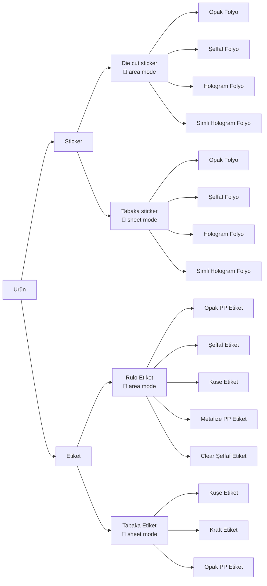

# Pim Etiket — Ürün Akışı Tam Matris

> **Kaynak:** Figma board (Sefa 17 May) + `/src/app/sticker/page.tsx` + `/src/app/etiket/page.tsx` + `/src/lib/pricing-engine/constants.ts`
> **Tarih:** 17 May 2026

---

## 🌳 Ürün ağacı (Figma + sistem birleşik)

```
                                                  ┌── Opak Folyo (vinil)
                                                  ├── Şeffaf Folyo (transparan)
                                                  ├── Hologram Folyo (holo)
                              ┌── Die cut sticker ┤
                              │   (area mode m²)  └── Simli Hologram Folyo (simli)
                              │                   📌 Mimaki UV 100/160
                              │                   🎨 Şekil: Kare/Yuvarlak/Özel/Kontur kesim
              ┌── Sticker ────┤                   ✨ Finiş: Yok / Parlak / Mat (+%10)
              │               │                   📊 Adet: 25-1000 (tier: 25/50/100/250/500/1000)
              │               │
              │               │                   ┌── Opak Folyo
              │               │                   ├── Şeffaf Folyo
              │               │                   ├── Hologram Folyo
              │               └── Tabaka Sticker ─┤
              │                   (sheet mode)    └── Simli Hologram Folyo
              │                                   🎨 Şekil: Kare/Yuvarlak/Özel (Kontur YOK)
Ürün ─────────┤                                   ✨ Finiş: Yok / Parlak / Mat
              │                                   📊 Adet: 25-1000
              │
              │                                   ┌── Opak PP Etiket (beyaz)
              │                                   ├── Şeffaf Etiket          ⚠ yeni
              │                                   ├── Kuşe Etiket (kuse)
              │             ┌── Rulo Etiket ──────┤
              │             │   (area mode m²)    ├── Metalize PP Etiket (metalik)
              │             │                     └── Clear Şeffaf Etiket (ultra)
              └── Etiket ───┤                     ✨ Kaplama: Yok/Mat+%15/Parlak+%15/Soft+%30
                            │                     🎨 Özelleştirme: Yok / Emboss+%30 / Yaldız+%50 / Spot UV+%25
                            │                     🌀 Sarım yönü + Göbek çapı (25/40/76mm) + Sarım adeti
                            │                     📊 Adet: 1K-50K (tier: 1K/2K/5K/10K/20K/50K)
                            │
                            │                     ┌── Kuşe Etiket
                            └── Tabaka Etiket ────┤
                                (sheet mode)      ├── Kraft Etiket
                                23×31 cm          └── Opak PP Etiket
                                                  ✨ Kaplama: Yok / Mat+%15 / Parlak+%15
                                                  ❌ Özelleştirme YOK (atölye kuralı)
                                                  📊 Adet: 250-10K (tier: 250/500/1K/2.5K/5K/10K)
```

---

## 📋 Tam Matris — Hangisi neyi kullanabiliyor

### Tablo 1 — Form-faktör matrisi

| Ürün | Form | Mode | Min/Max adet | Tier | Üretim |
|---|---|---|---|---|---|
| **Sticker** | Die cut | area (m²×alan×adet) | 25 / 1000 | 25-50-100-250-500-1K | Mimaki UV 100/160 |
| **Sticker** | Tabaka | sheet (TL/tabaka × N) | 25 / 1000 | 25-50-100-250-500-1K | Mimaki UV + el dizgisi |
| **Etiket** | Rulo | area (m²×alan×adet) | 1.000 / 50.000 | 1K-2K-5K-10K-20K-50K | Otomatik rulo makinesi |
| **Etiket** | Tabaka | sheet (TL/tabaka × N) | 250 / 10.000 | 250-500-1K-2.5K-5K-10K | El dizgisi (23×31 cm) |

### Tablo 2 — Malzeme × Form uyumluluğu

| Malzeme (id) | Sticker Die cut | Sticker Tabaka | Etiket Rulo | Etiket Tabaka |
|---|:---:|:---:|:---:|:---:|
| Opak Folyo (`vinil`) | ✓ | ✓ | – | – |
| Şeffaf Folyo (`transparan`) | ✓ | ✓ | – | – |
| Hologram Folyo (`holo`) | ✓ | ✓ | – | – |
| Simli Hologram Folyo (`simli`) | ✓ | ✓ | – | – |
| Opak PP Etiket (`beyaz`) | – | – | ✓ | ✓ |
| Şeffaf Etiket (yeni!) | – | – | ✓ | – |
| Kuşe Etiket (`kuse`) | – | – | ✓ | ✓ |
| Kraft Etiket (`kraft`) | – | – | ❌ KALKTI | ✓ |
| Metalize PP (`metalik`) | – | – | ✓ | – |
| Clear Şeffaf (`ultra`) | – | – | ✓ | – |

### Tablo 3 — Kaplama/Finiş × Form

| Seçenek | Sticker Die cut | Sticker Tabaka | Etiket Rulo | Etiket Tabaka | + % Etki |
|---|:---:|:---:|:---:|:---:|:---:|
| Yok / Kaplamasız | ✓ | ✓ | ✓ | ✓ | 0% |
| Parlak (selefon/yüzey) | ✓ | ✓ | ✓ | ✓ | 0% sticker · +15% etiket |
| Mat (selefon/yüzey) | ✓ | ✓ | ✓ | ✓ | +10% sticker · +15% etiket |
| Soft touch | – | – | ✓ | – | +30% |

### Tablo 4 — Özelleştirme × Form (sadece rulo etikette aktif)

| Özelleştirme (id) | Sticker Die cut | Sticker Tabaka | Etiket Rulo | Etiket Tabaka | + % Etki |
|---|:---:|:---:|:---:|:---:|:---:|
| Yok (`yok`) | (default) | (default) | ✓ | (default) | 0% |
| Emboss (`emboss`) | – | – | ✓ | ❌ | +30% |
| Sıcak yaldız (`yaldiz`) | – | – | ✓ | ❌ | +50% |
| Spot UV (`spotuv`) | – | – | ✓ | ❌ | +25% |

**Çoklu seçim:** Rulo etikette emboss + yaldız + spotuv aynı anda seçilebilir (toplamsal %).
**Yaldız renkleri** (yaldız seçilince alt menü): altın · gülkurusu · gümüş · bakır · siyah krom · yeşil · lacivert · holo

### Tablo 5 — Şekil × Form (sadece sticker)

| Şekil (id) | Sticker Die cut | Sticker Tabaka |
|---|:---:|:---:|
| Kare (`square`) | ✓ | ✓ |
| Yuvarlak (`circle`) | ✓ | ✓ |
| Özel oran (`ozel`) | ✓ | ✓ |
| Kontur kesim (`die`) | ✓ | ❌ (tabakada kontur yok) |

### Tablo 6 — Rulo'ya özel parametreler (sarım)

| Parametre | Değerler |
|---|---|
| Sarım yönü | 1 / 2 / 3 / 4 (içe/dışa sağ/sol) |
| Göbek çapı | 25mm · 40mm · **76mm (3" — standart)** |
| Sarım adeti (1 ruloda) | 250 · 500 · 750 · 1000 |

### Tablo 7 — Bonus indirimler (tüm ürünlerde aktif)

| Tip | Eşik | İndirim |
|---|---|---|
| **Tasarım sayısı** (etiket) | 1 → 0% · 2-3 → 2% · 4-5 → 4% · 6-10 → 6% · 11-25 → 8% · **26-50 → 10%** | Toplam üzerinden |
| **Sepet grup indirimi** (sticker, aynı boyut çoklu tasarım) | 2 → 3% · 3-5 → 5% · 6-9 → 8% · **10+ → 10%** | Toplam üzerinden |

---

## 🗄 DB Scope Mapping (admin paneli)

```
pricing_config (Supabase)
├── scope: "sticker"          ← MEVCUT, BÖLÜNECEK
│                                → "sticker_die_cut" + "sticker_tabaka"
├── scope: "etiket_rulo"      ← MEVCUT (5 malzeme rename gerek)
├── scope: "etiket_tabaka"    ← MEVCUT (sheet mode aktif Migration 050)
└── scope: "global"           ← (kullanılmıyor şu an)
```

**Migration 051 planı:**
1. `sticker` scope'unu **`sticker_die_cut`** olarak yeniden adlandır
2. Yeni **`sticker_tabaka`** scope ekle (sheet mode, 4 folyo, fiyat seed)
3. `etiket_rulo` malzemelerini yeniden düzenle:
   - `kraft` → kaldır
   - `Opak PP Etiket` aynı kalır
   - `ultra` → name "Clear Şeffaf Etiket"
   - `metalik` → name "Metalize PP Etiket"
   - Yeni: `seffaf` (Şeffaf Etiket) ekle
4. Malzeme name güncellemeleri (sticker_die_cut + sticker_tabaka):
   - `vinil` → "Opak Folyo"
   - `transparan` → "Şeffaf Folyo"
   - `holo` → "Hologram Folyo"
   - `simli` → "Simli Hologram Folyo"

---

## 🎨 Mermaid diyagramı (Figma/Notion/GitHub'a yapıştırılabilir)



---

## ⚙ Üretim/Operasyon notları

| Notu | Geçerli olduğu form |
|---|---|
| Mimaki UV 100/160 baskı | Sticker (her iki form) |
| 23×31 cm tabaka (zarf 24×32) | Etiket Tabaka — büyük ihtimal Sticker Tabaka için aynı (onaylanmalı) |
| Kullanılabilir alan 19×27 cm (4 cm marj) | Tüm tabaka modları |
| Otomatik rulo makinesi | Etiket Rulo |
| El dizgisi (manuel) | Sticker Tabaka + Etiket Tabaka |

---

## 🔴 Belirsizlikler — Sefa onayı bekleyen

1. **Sticker Tabaka boyutu:** Etiket gibi 23×31 cm mi yoksa folyolar için farklı (A3 30×42 olabilir)?
2. **Sticker Tabaka fiyat aralığı:** Folyo daha pahalı malzeme — kuşe 22 TL/tabaka iken folyo kaç olmalı?
3. **Etiket Rulo'da "Kraft" kalktı** — eski siparişlerde kraft seçili olanlar var, migration sırasında ne yapalım?
4. **Sticker Tabaka'da Kontur kesim olur mu?** (Şu an die cut'a özel; tabakada el dizgisi olduğu için muhtemelen yok)
5. **Sticker özelleştirme:** Sticker'ın hiç özelleştirme seçeneği yok (sadece finiş). Folyo için UV vernik/lak gibi yeni özelleştirme ekleyeceği iz miyiz?

---

## 📌 Sonraki adım

Bu doküman temel referans. Sefa onay verince:
- Migration 051 (DB seed güncelle, scope böl)
- `/admin/fiyatlar` 3 tab → **4 tab**
- Yeni `/admin/fiyat-hesapla-sticker-tabaka` sayfası
- `/sticker` müşteri sayfası: cutMode → DB'den config çek (şu an hardcoded)
- `/etiket` müşteri sayfası: malzeme listesi DB'den (şu an hardcoded)
